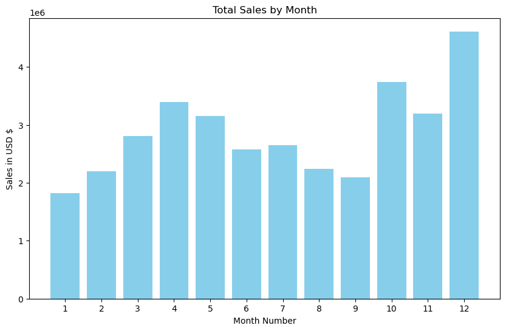
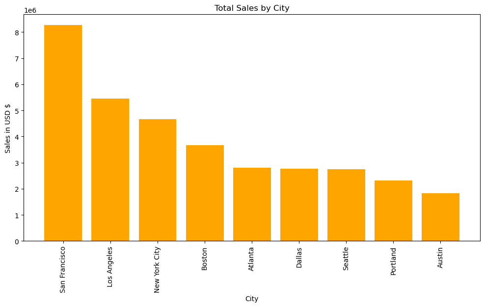
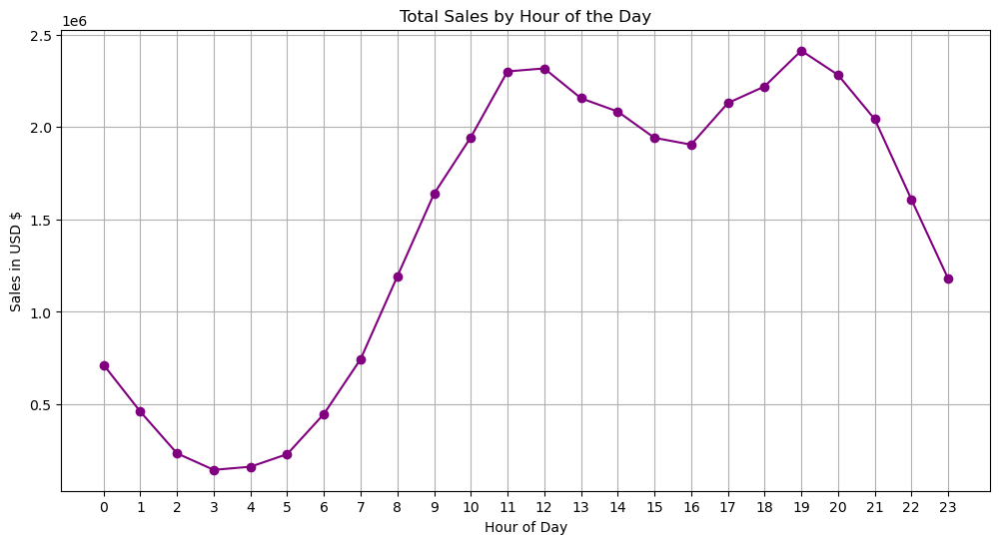
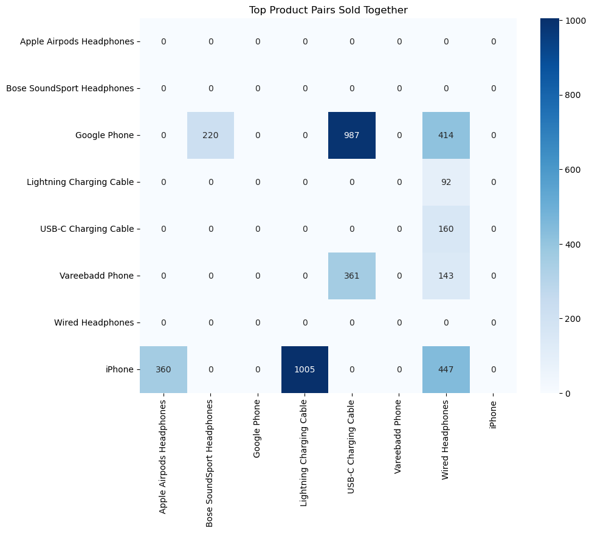
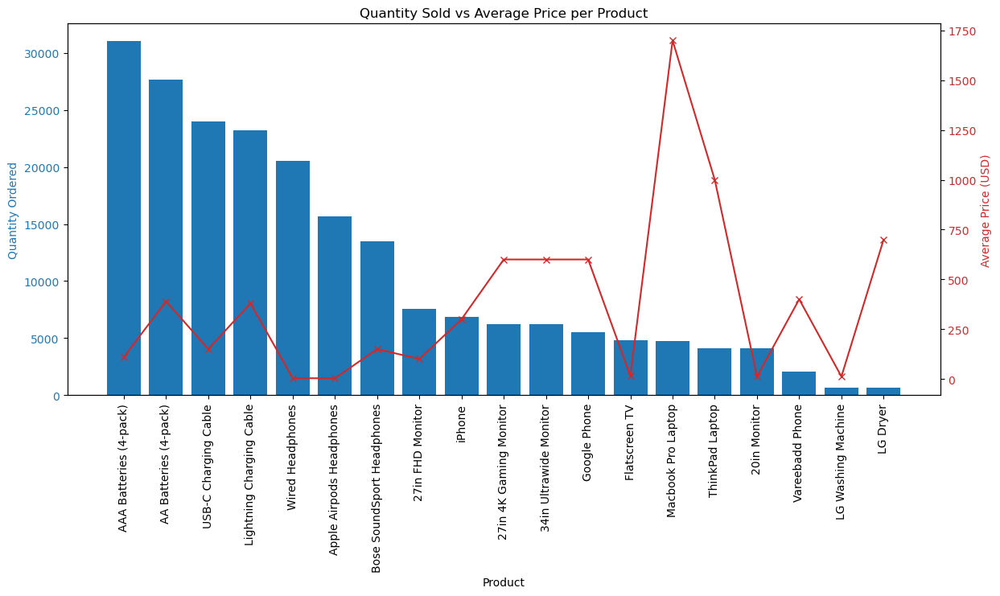
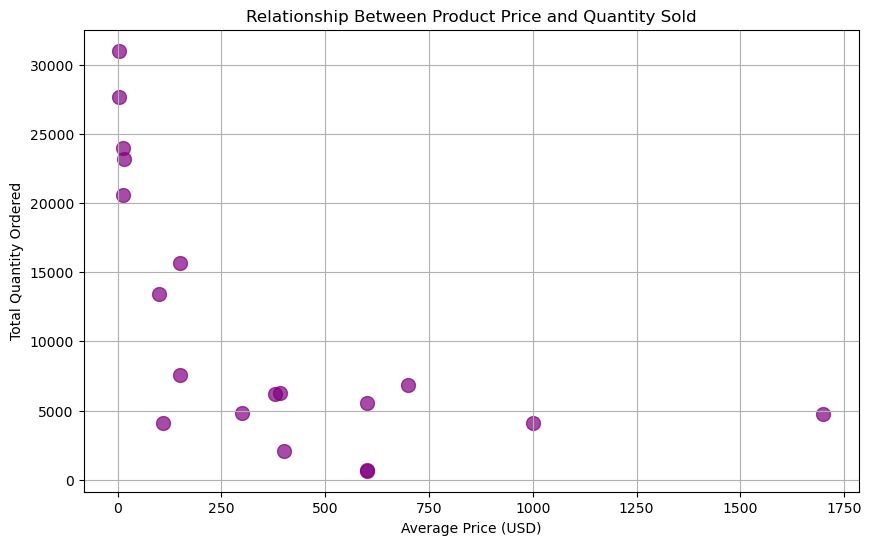

# 🛒 Sales Analysis 2019 – Full EDA & Insights  
تحليل بيانات المبيعات لعام 2019 – استكشاف، تصوّر، واستخلاص رؤى

---

## 🚀 Project Highlights  
- Full end‑to‑end EDA  
- 12 months of real sales data  
- Visual insights  
- Product bundles analysis  
- Clean, reproducible notebook  
- Professional repository structure  

---

## 🏷️ Badges

  
  
  
  
  

---

## 📂 Repository Structure | هيكل الريبو

project/
│
├── notebooks/
│   └── sales_analysis_2019.ipynb
│
├── data/
│   └── all_data.csv
│
├── images/
│   ├── monthly_sales.png
│   ├── city_sales.png
│   ├── hourly_sales.png
│   ├── product_pairs_heatmap.png
│   ├── quantity_vs_price.png
│   └── price_quantity_scatter.png
│
└── README.md

---

## 🧹 Data Cleaning | تنظيف البيانات

- Removing missing values  
- Fixing data types  
- Extracting Month, City, Hour  
- Removing invalid rows  
- Creating new features  

---

## 📊 Key Questions & Visualizations | أهم الأسئلة والرسومات

### **Q1: What was the best month for sales?**  

### **Q2: Which city had the highest sales?**  

### **Q3: What time should we display advertisements?**  

### **Q4: What products are most often sold together?**  

### **Q5: What product sold the most and why?**  
  

---

## 📝 Final Summary | الملخص النهائي

- December is the best month for sales  
- San Francisco leads all cities  
- Best advertising times: **11 AM** & **7 PM**  
- Strong product bundles (phones + accessories)  
- Lower‑priced items sell the most  

---

## 🛠 Tools Used | الأدوات المستخدمة

- Python  
- Pandas  
- Matplotlib  
- Seaborn  
- Jupyter Notebook  

---

# 📬 Connect With Me

  

  

  

